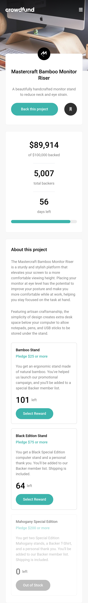

# Frontend Mentor - Crowdfunding product page solution

This is a solution to the [Crowdfunding product page challenge on Frontend Mentor](https://www.frontendmentor.io/challenges/crowdfunding-product-page-7uvcZe7ZR). Frontend Mentor challenges help you improve your coding skills by building realistic projects.

## Table of contents

-   [Overview](#overview)
    -   [The challenge](#the-challenge)
    -   [Screenshot](#screenshot)
    -   [Links](#links)
-   [My process](#my-process)
    -   [Built with](#built-with)
    -   [What I learned](#what-i-learned)
    -   [Continued development](#continued-development)
    -   [Useful resources](#useful-resources)
-   [Author](#author)

## Overview

### The challenge

Users should be able to:

-   View the optimal layout depending on their device's screen size
-   See hover states for interactive elements
-   Make a selection of which pledge to make
-   See an updated progress bar and total money raised based on their pledge total after confirming a pledge
-   See the number of total backers increment by one after confirming a pledge
-   Toggle whether or not the product is bookmarked

### Screenshot

### Links

-   Solution URL: [Github](https://github.com/GabeGar/crowdfunding-product-page)
-   Live Site URL: [Gh-pages](https://gabegar.github.io/crowdfunding-product-page)

## My process

### Built with

-   Mobile-first workflow
-   [React](https://reactjs.org/) - JS library
-   [Framer](https://www.framer.com/motion/) -ReactJS library
-   [Tailwind](https://tailwindcss.com/) - CSS framework
-   Semantic HTML5 markup
-   Flexbox

### What I learned

-   How to utilize and implement the framer-motion react library in my project, for handling animations and transitions.
-   Reinforced the concept of react's built-in global state management system, with createContext/useContext and useReducer hook, combination.

### Continued development

-   Improving the way I control complicated conditional statements, for triggering conditional renders. Definitely struggled a bit on this front as I was not able to get the modal design on the desktop overlay, 100%. Will likely come back to this at a later date.

### Useful resources

-   [Example resource 1](https://www.framer.com/motion/component/)
    -   for animating the components or built-in html elements.

## Author

-   Frontend Mentor - [@Gabegar](https://www.frontendmentor.io/profile/GabeGar)
